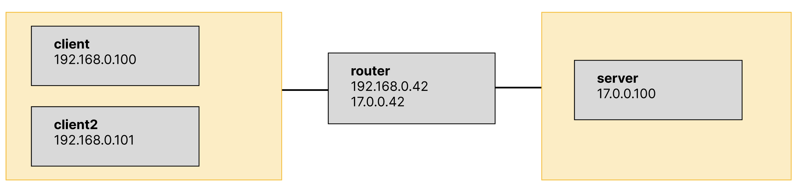

# Docker NAT Simulator

The logic is loosely based on https://github.com/zzJinux/docker-nat-simulate, but it replaces all bash scripts used for setup with a Docker compose setup.

The setup only uses iptables to achieve NAT-ing.

## Network Setup



* The clients (192.168.0.0/16) are in a network that's assumed to be separate from the rest of the network by a NAT.
* The server (10.0.0.100) is on the other side of the NAT.
* The router (192.168.0.42 and 10.0.0.42, respectively) acts as a NAT between these two networks.

## Running

```bash
docker compose build && docker compose up
```

## Validating the Setup

### Using `ping`

Open a shell on one of the clients:
```bash
docker exec -it client /bin/bash
```

Then ping the server:
```bash
ping server
```

This works since the NAT is translating addresses from the internal network to the outside world.

Conversely, trying to ping the client from the server does not work, as we'd expect.

Open a shell on one of the server:
```bash
docker exec -it server /bin/bash
```

And try to ping the client:
```bash
ping 192.168.0.100
```

#### Simulating a network delay

Open a shell on the router (`router`) and add a delay:
```bash
tc qdisc add dev eth0 root netem delay 50ms
```

Now ping the server again from the client container. It's not clear to me why this results in an RTT of 50ms (and not 100ms) though.

### Using `netcat`

While the `ping` test shows that basic connectivity is as we'd expect, it doesn't prove that we've actually built a NAT. For that, we'll use `netcat`.

Open a shell on the server, and start a server:
```bash
ncat -vk -l 80 -c 'xargs -n1 echo Echo from the server: '
```

Now in a separate terminal, open a shell on the first client, and establish a connection to the server:
```bash
ncat -v -p 45678 server 80
```

On the server side, we now see an incoming connection originating from 10.0.0.42:45678. It makes sense that we see the connection originating from the router (that's exacty what a NAT is supposed to do). It looks like iptables chose to preserve the port number.

To check that the NAT functions correctly, open a shell on the second client (`client2`), and establish another connection to the server, using the same source port:
```bash
ncat -v -p 45678 server 80
```

Now the NAT has no choice but to allocate a new port number, since both clients are using the same port. You should see an incoming connection on the server from a randomly allocated port number.
