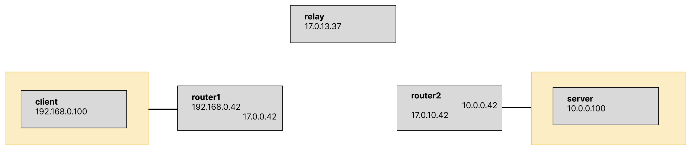

# Docker NAT Simulator

The logic is loosely based on https://github.com/zzJinux/docker-nat-simulate, but it replaces all bash scripts used for setup with a Docker compose setup.

The setup only uses iptables to achieve NAT-ing.

## Network Setup



* The clients (192.168.0.0/16) are in a network that's assumed to be separate from the rest of the network by a NAT.
* The server (10.0.0.100) is on the other side of the NAT.
* The router (192.168.0.42 and 10.0.0.42, respectively) acts as a NAT between these two networks.

## Running

```bash
docker compose build && docker compose up
```


